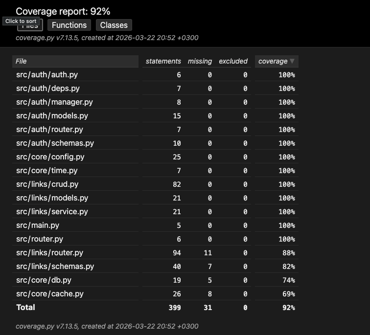

# URL Shortener API

Сервис сокращения ссылок на `FastAPI` с хранением данных в `PostgreSQL`, кешированием редиректов в `Redis` и проксированием через `nginx`.

## Стек

- `FastAPI`
- `PostgreSQL`
- `Redis`
- `SQLAlchemy` / `SQLModel`
- `Alembic`
- `Docker Compose`
- `nginx`

## Запуск

### Docker Compose

1. Создай `.env` в корне проекта.

```env
DB_NAME=app_db
DB_USER=app_user
DB_PASS=strong_password
JWT_SECRET=super_secret_jwt_key
UNIQUE_SALT=super_secret_salt
INACTIVE_LINK_DAYS=30
```

2. Подними сервисы:

```bash
docker compose down -v
docker compose up -d --build
```

3. Приложение будет доступно:

```text
http://<host>:1111
http://<host>:1111/docs
```

### Локальный запуск

1. Установи зависимости:

```bash
python -m venv .venv
source .venv/bin/activate
pip install -r requirements.txt
```

2. Подними `PostgreSQL` и `Redis`.

3. Примени миграции:

```bash
alembic upgrade head
```

4. Запусти приложение:

```bash
uvicorn src.main:app --reload
```

## Аутентификация

Используется JWT.

Поток работы:

1. `POST /auth/register`
2. `POST /auth/jwt/login`
3. Передача токена в заголовке:

```text
Authorization: Bearer <token>
```

`POST /auth/jwt/login` ожидает `application/x-www-form-urlencoded`:

- `username` = email
- `password` = пароль

## API

### Auth

#### `POST /auth/register`

Регистрация пользователя.

```json
{
  "email": "user@example.com",
  "password": "strongpassword"
}
```

#### `POST /auth/jwt/login`

Логин и получение JWT.

```bash
curl -X POST "http://localhost:1111/auth/jwt/login" \
  -H "Content-Type: application/x-www-form-urlencoded" \
  -d "username=user@example.com&password=strongpassword"
```

### Links

#### `POST /links/shorten`

Создать короткую ссылку.

- доступно всем
- если передан JWT, ссылка привязывается к пользователю
- если `expires_at` не передан, ссылка живёт 1 час

Пример тела:

```json
{
  "url": "https://example.com",
  "alias": "example",
  "expires_at": "2026-03-15T21:30:00+03:00"
}
```

#### `GET /links/{short_code}`

Редирект на оригинальный URL.

- сначала проверяется `Redis`
- при cache miss ссылка ищется в `PostgreSQL`
- переход сохраняется в `stats`

#### `GET /links/{short_code}/stats`

Статистика по короткой ссылке:

- оригинальный URL
- дата создания
- количество переходов
- дата последнего использования

#### `GET /links/search?original_url={url}`

Поиск короткой ссылки по оригинальному URL.

#### `GET /links/my`

Список ссылок пользователя.

- требует JWT для непустого результата
- без токена возвращает пустой список

#### `PUT /links/{short_code}`

Обновление ссылки.

- требует JWT
- доступно только владельцу
- если передан `alias`, он становится новым `short_code`
- если `alias` не передан, `short_code` генерируется автоматически

#### `DELETE /links/{short_code}`

Удаление ссылки.

- требует JWT
- доступно только владельцу

## Примеры запросов

### Регистрация

```bash
curl -X POST "http://localhost:1111/auth/register" \
  -H "Content-Type: application/json" \
  -d '{
    "email": "user@example.com",
    "password": "strongpassword"
  }'
```

### Получение JWT

```bash
curl -X POST "http://localhost:1111/auth/jwt/login" \
  -H "Content-Type: application/x-www-form-urlencoded" \
  -d "username=user@example.com&password=strongpassword"
```

### Создание ссылки

```bash
curl -X POST "http://localhost:1111/links/shorten" \
  -H "Content-Type: application/json" \
  -d '{
    "url": "https://example.com",
    "alias": "example"
  }'
```

### Создание ссылки с токеном

```bash
curl -X POST "http://localhost:1111/links/shorten" \
  -H "Content-Type: application/json" \
  -H "Authorization: Bearer <token>" \
  -d '{
    "url": "https://example.com",
    "alias": "example"
  }'
```

### Редирект

```bash
curl -i "http://localhost:1111/links/example"
```

### Получение статистики

```bash
curl "http://localhost:1111/links/example/stats"
```

### Поиск по оригинальному URL

```bash
curl "http://localhost:1111/links/search?original_url=https://example.com"
```

### Обновление ссылки

```bash
curl -X PUT "http://localhost:1111/links/example" \
  -H "Content-Type: application/json" \
  -H "Authorization: Bearer <token>" \
  -d '{
    "alias": "example2"
  }'
```

### Удаление ссылки

```bash
curl -X DELETE "http://localhost:1111/links/example2" \
  -H "Authorization: Bearer <token>"
```

## База данных

### `users`

- `id`
- `email`
- `hashed_password`
- `is_active`
- `is_superuser`
- `is_verified`
- `registered_at`

### `urls`

- `id`
- `url` — оригинальный URL
- `short_code` — короткий код
- `alias` — пользовательский алиас
- `created_at`
- `expires_at`
- `user_id` — владелец ссылки

### `stats`

- `id`
- `url_id`
- `redirected_at`

На основе `stats` считаются:

- число переходов: `count(*)`
- последнее использование: `max(redirected_at)`

## Тесты

Для тестов нужна отдельная база:

```bash
docker run --name project3-test-postgres \
  -e POSTGRES_DB=test_db \
  -e POSTGRES_USER=test_user \
  -e POSTGRES_PASSWORD=test_password \
  -p 5433:5432 \
  -d postgres:16
```

Запуск тестов:

```bash
pytest --cov=src --cov-report=html
```

HTML-отчёт будет создан в папке `htmlcov/`.


Процент покрытия тестами:


Результаты нагрузочного тестирования:
- [Locust HTML Report](./locust_report.html)

## Дополнительно

- время в приложении считается в `UTC+3`
- ссылки по умолчанию живут 1 час
- неиспользуемые ссылки автоматически удаляются спустя `INACTIVE_LINK_DAYS`
- редиректы кешируются в `Redis`
